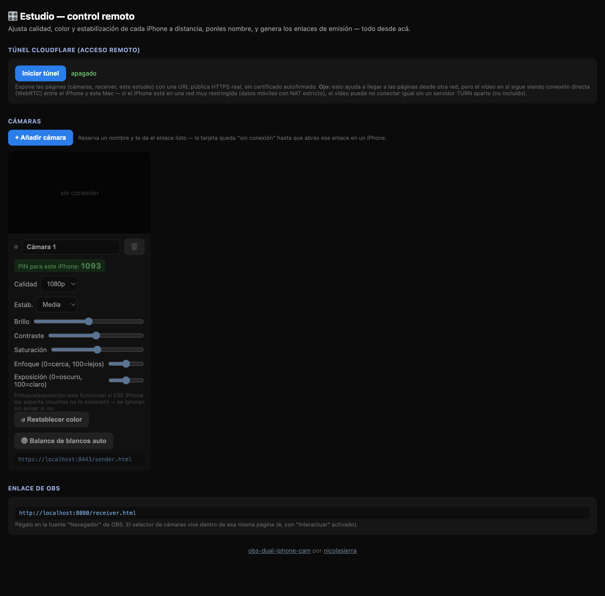
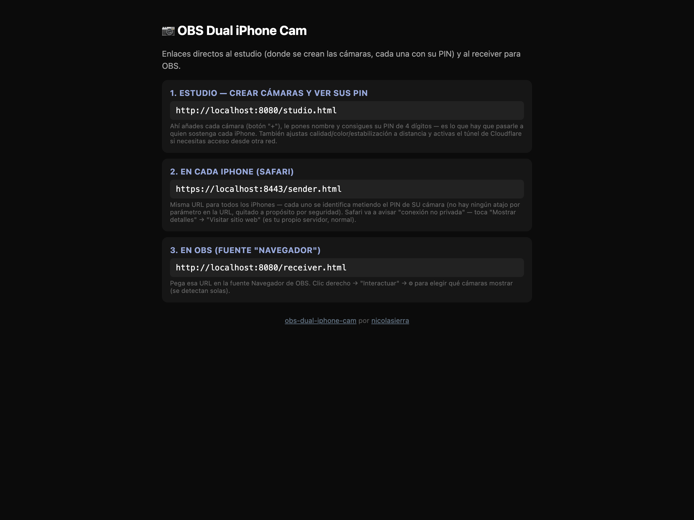

# OBS Dual iPhone Cam

🇬🇧 [Read in English](README.md)

Usa 2 (o más) iPhones como cámaras en OBS **sin apps de pago** (ni Camo, ni
EpocCam, ni iVCam), usando solo Safari en el iPhone y un pequeño servidor
Node.js que corre en tu Mac. Incluye una **estabilización digital básica**
basada en el giroscopio del iPhone.

| Estudio (control remoto) | Página de inicio |
|---|---|
|  |  |

## Cómo funciona

```
iPhone 1 (Safari) ─┐                          ┌─ OBS (fuente "Navegador")
                    ├─ WebRTC (P2P, misma WiFi) ┤
iPhone 2 (Safari) ─┘                          └─ ve ambos videos en vivo
```

- Cada iPhone abre una página (`sender.html`) que activa la cámara,
  aplica estabilización digital en tiempo real y envía el video por WebRTC.
- Tu Mac corre `server.js`: sirve las páginas por HTTPS (necesario para que
  Safari permita usar la cámara) y hace de "central telefónica" (señalización)
  para que los iPhones y OBS se encuentren.
- En OBS añades una fuente **Navegador** apuntando a `receiver.html`, que
  recibe ambos videos y los muestra — OBS la trata como una fuente de video
  en vivo, no necesitas ninguna cámara virtual ni driver adicional.

Todo corre dentro de tu red local; no se sube nada a internet.

## Requisitos

- Un Mac (o PC) con [Node.js](https://nodejs.org) instalado (v18+).
- Los iPhones y el ordenador conectados a la **misma red WiFi**.
- OBS con la fuente **"Navegador" (Browser Source)**, que ya trae de fábrica.

## Instalación

```bash
cd obs-dual-iphone-cam
npm install
node server.js
```

La primera vez, el servidor genera automáticamente un certificado HTTPS
autofirmado y te imprime algo así:

```
Primero crea tus cámaras (con su PIN) desde el estudio:
  http://192.168.1.23:8080/studio.html

Desde cada iPhone (Safari, misma WiFi que este ordenador), abre:
  https://192.168.1.23:8443/sender.html
  ...e ingresa el PIN de 4 dígitos que te dio el estudio para esa cámara.

En OBS, añade una fuente "Navegador" apuntando a:
  http://localhost:8080/receiver.html
```

> **Importante:** para OBS usa **`http://localhost:8080`** (sin "s"), no
> HTTPS. El navegador embebido de OBS (CEF) no tiene forma de "aceptar" un
> certificado autofirmado — no hay ningún aviso que tocar como en Safari —
> así que si le das una URL HTTPS se queda simplemente en negro, sin
> ningún error visible. `receiver.html` no usa la cámara, así que no
> necesita HTTPS: por eso el servidor también sirve por HTTP plano en el
> puerto 8080, solo para esto.

Deja esta terminal abierta (el servidor debe seguir corriendo mientras
transmites).

### Página de inicio

Abre `http://<IP-del-Mac>:8080/` (o `https://<IP-del-Mac>:8443/` desde el
propio Mac/iPhone) — te da los enlaces directos al estudio y al receiver
de OBS, listos para copiar o abrir. Las cámaras en sí se crean desde el
estudio (ver "Estudio — control remoto" más abajo), no desde aquí.

## Paso a paso

### 1. En cada iPhone

1. **Primero, crea la cámara desde el estudio** (`studio.html`, botón "+
   Añadir cámara") — te da un **PIN de 4 dígitos** para esa cámara en
   concreto (ver "Estudio" más abajo).
2. Abre Safari en el iPhone (tiene que ser Safari, no Chrome, para el
   permiso de movimiento/giroscopio en iOS) y visita
   `https://192.168.1.23:8443/sender.html` — te pedirá ese PIN. Escríbelo
   y toca "Entrar". **No hay ningún atajo por URL**: el PIN es la única
   forma de identificarse como una cámara concreta (2026-09-12, quitado a
   propósito por seguridad — antes existía un `?id=camN` que se saltaba
   el PIN).
3. Safari mostrará **"Esta conexión no es privada"** porque el certificado
   es autofirmado (normal, es tu propio servidor). Toca **"Mostrar detalles"
   → "visitar este sitio web" → "Visitar sitio web"**.
4. Toca **"Iniciar cámara y conectar"**. Acepta los permisos de cámara y de
   movimiento/orientación que te pida iOS (el de movimiento es necesario
   para la estabilización).
5. Debajo verás el estado pasar de "conectando" a **"conectado ✔"** en
   cuanto abras `receiver.html` en el paso 2. Puedes desmarcar
   "Estabilización" si prefieres la imagen sin recortar, o marcar "Cámara
   frontal" para usar la cámara delantera.
6. Deja el iPhone con la pantalla encendida y en un soporte/trípode
   (el estabilizador digital corrige temblor de mano, no reemplaza un
   trípode).

### 2. En OBS (en el Mac)

1. Añade una fuente nueva → **Navegador**.
2. URL: `http://localhost:8080/receiver.html` (sin "s" — ver nota más
   arriba, y **sin `?ids=`** — ver "Elegir cámaras" más abajo, la selección
   se hace ahora desde dentro de la propia página, no hace falta ponerla en
   la URL).
3. Ancho/alto: los de tu escena (p. ej. 1920×1080).
4. Activa "Actualizar navegador cuando la escena se active" si vas a
   alternar de escena.
5. Clic derecho sobre la fuente → **Interactuar**, toca el engranaje ⚙
   (arriba a la derecha) y marca qué cámaras quieres ver — se acomodan
   solas en mosaico.

Si quieres cada cámara en una fuente separada (para poder moverlas o
recortarlas de forma independiente en la escena), simplemente añade tantas
fuentes de Navegador como cámaras, cada una con un solo id fijo en la URL:
`?ids=cam1`, `?ids=cam2`, etc. (esto sigue funcionando exactamente igual
que antes — ver "Modo fijo" más abajo).

## Elegir cámaras (selector en vivo, sin tocar URLs)

Desde la v2 (2026-09-12) ya no hace falta escribir/editar `?ids=cam1,cam2`
cada vez que sumas o sacas un iPhone. Con la fuente Navegador apuntando a
`receiver.html` a secas:

1. Clic derecho sobre la fuente en OBS → **Interactuar**.
2. Toca el ⚙ en la esquina superior derecha — se abre la lista de
   iPhones conectados AHORA MISMO (se refresca sola cada 3s).
3. Marca los que quieras mostrar. El mosaico se recalcula solo.

La selección queda guardada (en el propio navegador de esa fuente) — si
cierras y vuelves a abrir OBS, sigue mostrando las mismas cámaras sin que
tengas que volver a elegirlas.

**Modo fijo (compatibilidad con versiones anteriores)**: si le pones
`?ids=cam1,cam2` explícito en la URL, se comporta exactamente como antes
(lista fija, sin selector ni engranaje) — útil si prefieres seguir
controlándolo así, o para fuentes separadas por cámara (ver arriba).

## Más de 2 cámaras

No hay límite fijo — usa el `id` que quieras (`cam1`, `cam2`, `cam3`,
`cam4`...) en cada iPhone. El engranaje del receiver los detecta solos
(ver arriba); si prefieres el modo fijo, súmalos separados por coma:
`?ids=cam1,cam2,cam3,cam4`. El mosaico se acomoda solo según cuántas
metas (2 → una fila de 2, 4 → 2×2, etc.) — si quieres forzar un número de
columnas concreto, agrega `&layout=cols-3`.

La página de inicio (ver más arriba) sigue generando los enlaces de cada
sender por ti (para copiarlos a los iPhones); ya no hace falta armar la
URL del receiver a mano en absoluto.

## Estudio — control remoto (2026-09-12)

`http://<IP-del-Mac>:8080/studio.html` es una tercera página, separada de
las de cada cámara y de la de OBS, pensada para gestionar todo desde un solo
sitio (por ejemplo, desde un iPad al lado de la mesa de control) sin tocar
los iPhones ni la fuente de OBS:

- **Vista previa en vivo** de cada cámara conectada.
- **Añadir cámara**: las cámaras se crean SOLO desde aquí (botón "+"). Cada
  una nace con un **PIN de 4 dígitos** único — ese es el que hay que pasarle
  a quien va a sostener el iPhone (ver "1. En cada iPhone" más arriba). Sin
  crearla desde el estudio, no existe ningún PIN válido para usarla.
- **Eliminar cámara**: botón 🗑 en cada tarjeta — la borra del todo (nombre y
  PIN); si ese iPhone sigue con `sender.html` abierto, se queda sin poder
  reconectar hasta que se le dé un PIN nuevo de otra cámara.
- **Nombre**: ponle un nombre a cada cámara (se guarda solo, sobrevive un
  reinicio del servidor) — se ve en el propio iPhone, en el selector del
  receiver, y aquí mismo.
- **Enfoque manual**: si el iPhone conectado lo soporta (no todos lo
  exponen por navegador), aparece un control de enfoque además de
  Calidad/Estabilización/Color.
- **Exposición manual**: mismo criterio que el enfoque (solo aparece si el
  dispositivo lo soporta) — útil cuando la cámara se equivoca sola con
  luces muy contrastadas.
- **Balance de blancos automático**: botón "⚪" que le pide a la cámara
  recalibrar el blanco ahora mismo (útil al cambiar de luz — de ventana a
  lámpara, por ejemplo). Es una acción puntual, no un valor que se guarde;
  como el enfoque, solo aparece/hace algo si ESE iPhone lo soporta.
- **Calidad, Estabilización, Color, Enfoque y Exposición a distancia**: los
  mismos controles de `sender.html`, pero manejados desde el estudio — se
  aplican al iPhone en vivo (mismo mecanismo que ya permite cambiarlos sin
  reiniciar, ver más abajo), sin que nadie tenga que tocar el teléfono.
- **Se recuerda el último ajuste de cada cámara**: calidad, estabilización,
  color, enfoque y exposición se guardan por cámara (junto a su PIN, en
  `cameras.json`) cada vez que se cambian de verdad — vengan del propio
  iPhone o del estudio. La próxima vez que esa cámara se conecte (aunque
  sea otro iPhone con el mismo PIN, o tras reiniciar el servidor), arranca
  ya con esos valores en vez de volver siempre a los de fábrica.
- **Enlace de sender.html**, listo para copiar y mandar a quien sostenga
  el iPhone — es el mismo para todas las cámaras (genérico, sin `?id=`);
  lo que identifica CADA cámara es el PIN de su tarjeta, no la URL.
- **Túnel de Cloudflare**: un botón para exponer las páginas (cámaras,
  receiver, este mismo estudio) con una URL pública `*.trycloudflare.com`
  — HTTPS real de Cloudflare, sin el aviso de certificado autofirmado.

**Límite real, para que no sorprenda**: el túnel resuelve que las
*páginas* se puedan abrir desde otra red — no resuelve por sí solo que el
*vídeo* (WebRTC, conexión directa entre el iPhone y el Mac) atraviese
cualquier NAT. Funciona bien entre redes "normales"; con datos móviles o
redes muy restringidas (NAT simétrico/CGNAT) puede no conectar el vídeo
sin un servidor TURN aparte — no incluido en esta versión, sería una pieza
separada si hace falta más adelante.

**Si el botón del túnel da error tipo "no se pudo lanzar cloudflared"**: es
que el binario `cloudflared` no está instalado (o no está en el `PATH`) en
ese Mac concreto — instálalo con `brew install cloudflared` y vuelve a
intentar. El estudio muestra este mensaje tal cual en rojo si pasa.

## Ajuste de color en vivo

En `sender.html` hay 3 controles (Brillo, Contraste, Saturación, 50%-150%
los dos primeros y 0%-200% saturación) que se aplican al vídeo en tiempo
real, sin tocar "Detener"/"Iniciar" (igual que Calidad y Estabilización).
Útil para igualar el tono de 2 cámaras distintas (un iPhone más nuevo suele
verse distinto a uno viejo) o compensar luz de ambiente amarilla/verdosa.
El botón "↺ Restablecer" los vuelve todos a 100%.

## Calidad de imagen

En `sender.html` hay un selector **Calidad** con 3 niveles:

| Preset | Resolución pedida a la cámara | Bitrate objetivo |
|---|---|---|
| 720p  | 1280×720  | 3 Mbps |
| 1080p | 1920×1080 | 6 Mbps (por defecto) |
| 1440p | 2560×1440 | 10 Mbps |

Además de pedirle esa resolución a la cámara, la página ahora:
- Fija explícitamente el **bitrate máximo** de la conexión WebRTC (antes
  se dejaba en el valor por defecto del navegador, que suele arrancar muy
  bajo y no siempre termina de subir en redes WiFi caseras — de ahí la
  imagen borrosa que veías).
- Le pide al codificador **priorizar nitidez sobre fps** si falta ancho
  de banda (`degradationPreference: "maintain-resolution"`).
- Prefiere el códec **H.264** cuando el navegador lo permite, que en el
  iPhone se codifica por hardware y conserva mejor el detalle que el
  códec por defecto (VP8) a igual bitrate.
- Debajo del estado verás una línea con la resolución y fps que
  realmente se están **enviando** (`enviando: 1920x1080 @ 30fps · ...`),
  útil para confirmar que el nivel elegido se está aplicando de verdad y
  no hay algo (WiFi débil, cámara que no soporta esa resolución) tirando
  la calidad hacia abajo silenciosamente.

Cambiar el selector de Calidad se aplica en vivo (2026-09-12): la
resolución se pide de nuevo a la misma cámara ya activa (`applyConstraints`,
sin reiniciar getUserMedia) y el bitrate máximo se ajusta al vuelo sobre la
conexión ya establecida — no hace falta tocar "Detener"/"Iniciar". Lo mismo
vale para Estabilización. Solo "Cámara frontal" sigue necesitando
reiniciar, porque cambia de cámara física (frontal↔trasera), no es un
simple ajuste sobre la misma.

**Si aun así se ve borroso**, casi siempre es la WiFi la que no sostiene
el bitrate elegido (más común en la banda de 2.4GHz o con el router
lejos): prueba a bajar a 720p, acercar el iPhone al router, o usar la banda
de 5GHz si tu router la separa.

## Sobre la estabilización

Es una estabilización **digital** (no óptica), pensada para atenuar el
temblor de sostener el móvil con la mano — no es tan buena como el modo
"Cinematic" de Apple, pero es gratis y corre en tiempo real. Ahora tiene
un selector **Estabilización** con 4 niveles (Desactivada / Suave / Media
/ Fuerte) directamente en `sender.html`, sin tocar código.

Cómo funciona, en dos etapas:
1. **Filtro paso-alto**: integra el giroscopio (`devicemotion`) y deja que
   ese valor decaiga con una constante de tiempo — así el temblor rápido
   se corrige, pero un paneo lento e intencionado (mover la cámara a
   propósito) se "olvida" solo y no se fuerza en contra.
2. **Suavizado**: el valor que realmente se aplica al recorte se
   interpola frame a frame, para que la corrección misma no tiemble por
   ruido del sensor.

El recorte (y por tanto el "zoom" que sacrificas) crece con el nivel:
Suave recorta ~7%, Media ~12%, Fuerte ~18%. Si necesitas más corrección
para temblor fuerte, prueba "Fuerte"; si notas que se ve "flotante" o
pierde demasiado encuadre, baja a "Suave".

Si quieres afinar los números exactos, están en `public/sender.html` en el
objeto `STAB_PRESETS` (`marginRatio`, `gain`, `tau`, `smoothTau`).

Consejo: cuanta más luz haya, mejor funciona la imagen en general (como
cualquier cámara de móvil), y un soporte/mini trípode barato ayuda más que
cualquier estabilización digital — la digital corrige temblor de mano, no
reemplaza un punto de apoyo fijo.

## Reconexión automática

Si se corta la WiFi un instante en medio de una transmisión (o el propio
vídeo WebRTC se cae por un problema de red aunque la señalización siga
viva), `sender.html` reintenta solo — no hace falta tocar
Detener/Iniciar a mano. La cámara nunca se cierra durante esto, solo se
reconecta la señalización/el vídeo; la pantalla muestra "conexión
perdida, reintentando..." mientras lo hace. Esto SOLO se activa después
de un "Iniciar" que salió bien y hasta que se toque "Detener" a
propósito — un corte antes de arrancar o un Detener deliberado no
disparan ningún reintento.

## Problemas comunes

- **"No aparece nada en receiver.html"**: revisa que la cámara esté
  marcada en el selector ⚙ del receiver (ver "Elegir cámaras" más arriba)
  y que el iPhone siga en la página con "conectado ✔".
- **No conecta / se queda en "esperando"**: confirma que iPhone y Mac están
  en la misma WiFi, y que el router no tiene activado "aislamiento de
  cliente"/"AP isolation" (común en redes de invitados) — eso bloquea la
  conexión directa entre dispositivos aunque estén en la misma red.
- **Safari no ofrece cámara**: solo funciona en contexto seguro (HTTPS),
  por eso el servidor genera certificado — asegúrate de aceptar el aviso
  de certificado no confiable la primera vez.
- **Se corta al bloquear pantalla**: el iPhone puede pausar la cámara en
  segundo plano; mantenlo con la pantalla encendida durante la
  transmisión (la página ya pide mantener la pantalla activa con Wake
  Lock, pero iOS puede ignorarlo en algunos casos).
- **Quiero audio también**: en `sender.html`, cambia `audio: false` por
  `audio: true` dentro de `constraints` — pero si usas 2 iPhones con audio
  a la vez tendrás 2 fuentes de sonido simultáneas, mejor gestiona el
  audio por separado (p. ej. solo en uno de los dos).

## Estructura del proyecto

```
obs-dual-iphone-cam/
├── server.js          servidor HTTPS + señalización WebSocket + API (cámaras/túnel)
├── mini-static.js      servidor de archivos estáticos (sin dependencias)
├── package.json
├── LICENSE             MIT
├── certs/              certificado autofirmado (se genera solo, no lo compartas)
├── cameras.json         id -> {name, pin, settings} de cada cámara (se genera solo)
└── public/
    ├── index.html      enlaces directos al estudio, al sender y al receiver
    ├── sender.html     página que abre cada iPhone (pide el PIN)
    ├── receiver.html   página que se pone como fuente "Navegador" en OBS
    └── studio.html     crear cámaras (con su PIN), control remoto, túnel
```

## Licencia

[MIT](LICENSE) — © 2026 [Nicolás Sierra](https://github.com/nicolasierra)
